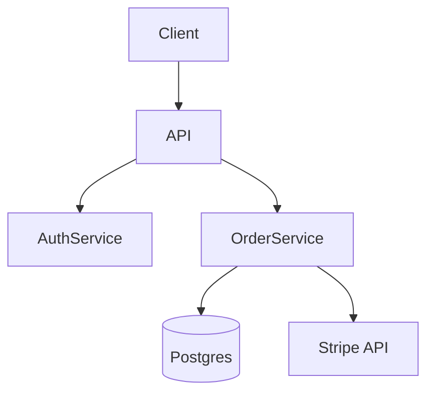
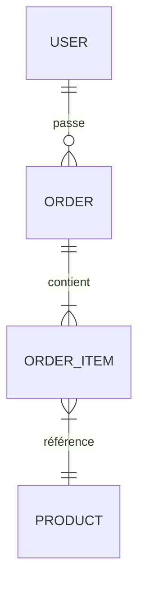

## _Cadrer l'usage de l'IA dans une équipe, et l'utiliser pour piloter_

---

# Deux profils, deux usages

L'IA dans une équipe ne sert pas à la même chose selon où vous êtes assis :

- **Dev** : génération de code, refactor, review, tests, debug. L'agent travaille dans le repo.
- **Manager / lead / chef de projet** : synthèse, suivi, rédaction de specs, préparation de réunions, relecture de PRs sans rentrer dans le code. L'agent travaille sur des notes, des tickets, des comptes-rendus.

Les deux profils peuvent (et devraient) utiliser le **même outil** — Codex, Claude Code, etc. — mais avec des **agents spécialisés** différents. C'est le rôle d'`AGENTS.md`.

---

# Un dépôt "manager" : pas de code, juste des docs et des skills

Côté manager, on peut se créer un repo dédié — sans une ligne de code applicatif. Juste :

```
mon-repo-manager/
├── AGENTS.md               # ou README.md — descriptif équipe / outils / préférences
├── .codex/commands/        # skills réutilisables (préparer-1-1, synthese-hebdo, etc.)
├── docs/
│   ├── templates/          # templates de tâches Jira, specs, post-mortems
│   ├── 1-1/                # notes de 1:1, un fichier par personne
│   └── meetings/           # comptes-rendus
├── PLAN.md                 # roadmap court terme (trimestre en cours)
├── TODO.md                 # mes actions à moi
└── ISSUES.md               # blocages connus, dette organisationnelle
```

Ce repo est versionné comme du code : git, branches si vous voulez, historique. L'agent l'ouvre comme n'importe quel autre projet — sauf qu'il y trouve **du contexte de management**, pas du code.

## Quels fichiers `.md` conventionnels ?

Pas de dogme — gardez ce qui vous sert :

- **AGENTS.md / README.md** : indispensable. Le contexte que l'agent doit charger à chaque session.
- **PLAN.md** : utile si vous avez une roadmap claire (trimestre, sprint).
- **TODO.md** : utile en perso pour vos actions à vous. Si l'équipe utilise déjà Jira/Linear pour ça, doublon.
- **ISSUES.md** : utile pour les **problèmes organisationnels** qui ne rentrent pas dans Jira (turnover, dette d'équipe, frictions process).
- **DECISIONS.md** : journal de décisions techniques importantes — une fiche courte par décision, datée. Format inspiré des **ADR** (Architecture Decision Records, popularisés par Michael Nygard) : contexte / options envisagées / choix retenu / conséquences. Très utile pour répondre 6 mois plus tard à "pourquoi Postgres et pas Mongo ?".

Règle simple : si l'agent doit lire le fichier souvent, gardez-le. Sinon supprimez.

---

# AGENTS.md : décrire l'équipe à l'agent

`AGENTS.md` (à la racine du repo, ou dans `~/` pour un usage perso) est un fichier que l'agent lit automatiquement à chaque session. Il y trouve le contexte qui ne change pas : qui vous êtes, qui est l'équipe, quels outils vous utilisez, ce qu'il doit éviter.

Exemple côté **manager** :

```markdown
# AGENTS.md

## Mon rôle
Lead technique d'une équipe de 6 (4 devs back, 2 front).
Je code peu — 80% de mon temps c'est review, specs, suivi.

## Mon équipe
- Alice : senior back, owner du module paiement
- Bob : junior back, en montée en compétence sur Postgres
- Carla : front, owner du design system
- ...

## Outils
- Linear pour les tickets (project "CORE")
- GitHub pour le code (org acme/)
- Slack pour la communication (#team-core)

## Comment je travaille
- Je préfère les comptes-rendus en bullet points, pas en prose
- Quand tu rédiges une spec, structure : contexte / objectif / non-objectifs / risques
- Pour les 1:1, sortir 3 questions max, pas un script complet
```

Avec ce fichier, vous n'avez plus à répéter le contexte à chaque prompt. L'agent sait à qui il parle et comment vous aider.

---

# Agents pour la gestion de projet

Quelques usages concrets côté manager — chaque exemple suppose qu'`AGENTS.md` est en place.

## Préparer une réunion

```
@notes/dernier-1-1-bob.md @linear/bob-tickets.json

Prépare 3 sujets pour mon prochain 1:1 avec Bob.
Cherche les tickets bloqués depuis > 3 jours, les PRs en attente
de review de sa part, et tout signal faible dans les notes précédentes.
```

## Synthèse hebdo

```
Lis tous les commits de la semaine sur acme/core (git log --since "7 days ago"),
les PRs mergées, et les tickets Linear passés en Done.
Sors une synthèse de 10 lignes max pour le standup de lundi.
Format : "Ce qui a avancé / Ce qui est bloqué / Décisions à prendre".
```

## Générer la doc d'un projet (avec schémas Mermaid)

Un cas d'usage qui combine tout : un skill qui parcourt un repo et écrit (ou met à jour) une doc d'architecture, **avec des schémas Mermaid** intégrés au markdown.

Mermaid est un langage de diagrammes en texte — rendu nativement par GitHub, GitLab, Hugo, Notion, et la plupart des viewers markdown. L'agent sait l'écrire : il n'a pas besoin d'un outil de dessin.

Générez le skill :

```
$skill-creator
```

```
Crée un skill doc-generate qui :
- explore le repo (ls, lecture des fichiers d'entrée : main.*, package.json,
  routes, modèles, schémas DB)
- déduit l'architecture : services, dépendances, flux de données, modèle métier
- écrit docs/ARCHITECTURE.md avec :
  * un schéma Mermaid "graph TD" des services et leurs dépendances
  * un schéma Mermaid "erDiagram" du modèle de données si une DB est détectée
  * un schéma Mermaid "sequenceDiagram" pour le flux principal (ex. login)
  * une section texte par composant : rôle, entrées/sorties, fichiers clés
- si docs/ARCHITECTURE.md existe déjà, met à jour sans écraser les sections
  marquées "<!-- manuel -->"
- ne décrit que ce qu'il voit dans le code — pas d'invention
```

Exemple de sortie attendue :

````markdown
## Vue d'ensemble



## Modèle de données


````

**Pourquoi c'est utile :**

- La doc reste **à jour** — re-lancez le skill après une grosse PR, il met à jour les schémas.
- Le diff de la doc est **lisible** dans une PR (du markdown, pas du PNG).
- Les schémas vivent **avec le code** — pas dans un Confluence qui pourrit.

À combiner avec `/loop` ou un cron pour re-générer la doc chaque semaine, ou un hook git pour la mettre à jour à chaque merge sur main.

## Interagir avec Jira via MCP

Le MCP Jira (Atlassian) permet à l'agent de lire et créer des tickets directement, sans copier-coller. Une fois le MCP configuré, l'agent voit Jira comme un outil natif.

```
Crée un ticket Jira dans le projet CORE avec le template docs/templates/bug.md.
Titre : "Doublons sur les commandes après 16h le 18/04".
Pré-remplis "Steps to reproduce" depuis ce que je viens de te dire,
laisse "Impact" et "Priority" à remplir par moi.
```

Ou en lecture :

```
Liste les tickets CORE assignés à Bob, statut "In Progress", non touchés depuis 5 jours.
Pour chacun, va lire le ticket et sors-moi : titre, dernier commentaire, blocage potentiel.
```

L'intérêt des **templates dans `docs/templates/`** (bug.md, feature.md, post-mortem.md, spec.md) : l'agent y trouve la structure que votre équipe utilise. Vous ne réécrivez jamais le format, vous dites juste "utilise le template X".

Exemple `docs/templates/bug.md` :

```markdown
## Contexte
[Quand, où, qui a vu le bug]

## Steps to reproduce
1.
2.

## Expected
## Actual
## Impact
## Priority
```

## Rédiger une spec

```
@notes/brainstorm-feature-x.md

Transforme ces notes en spec courte (1 page).
Sections : contexte, objectif, non-objectifs, risques, questions ouvertes.
N'invente pas — si une info manque, mets "[À CLARIFIER]".
```

Ce dernier point est important : **un agent invente quand on lui demande d'être complet**. Mieux vaut un trou explicite qu'une réponse hallucinée.

---

# Prompt engineering : ce qui marche vraiment

Quelques règles qui changent les résultats, dev comme manager :

## 1. Donnez du contexte avant la tâche

Mauvais :
```
Réécris ce paragraphe.
```

Bon :
```
Audience : devs juniors qui découvrent Git.
Objectif : comprendre git rebase sans peur.
Réécris ce paragraphe en gardant le ton informel.
```

## 2. Précisez le format de sortie

"Réponds en bullet points", "Tableau markdown", "JSON avec ces clés", "Maximum 5 lignes". L'agent suit ces contraintes — mais il faut les écrire.

## 3. Donnez un exemple

Un seul bon exemple vaut trois paragraphes d'instructions. C'est vrai pour le code comme pour la rédaction.

## 4. Demandez de poser des questions

```
Avant de répondre, pose-moi les 2 questions qui changeraient le plus
ta réponse si tu avais leurs réponses.
```

Évite les réponses génériques.

## 5. Utilisez les fichiers comme mémoire partagée

Les agents ne partagent pas de mémoire entre sessions. Mais ils savent lire et écrire des fichiers. Un compte-rendu de réunion en `.md`, une todo en `.md`, une spec en `.md` — c'est la mémoire de l'équipe **et** de l'agent.

---

# Les tensions à anticiper

| Tension | Ce qu'on entend |
|---------|-----------------|
| **Productivité vs Qualité** | "L'IA code plus vite mais le code est moins maintenable" |
| **Apprentissage vs Dépendance** | "Les juniors ne comprennent pas ce qu'ils committent" |
| **Confidentialité vs Cloud** | "On n'a pas le droit d'envoyer ce code à un modèle externe" |

Ces tensions ne se résolvent pas avec un outil — elles se résolvent avec des **règles d'équipe**.

---

# Trois guardrails minimum

Pas une convention parfaite — une convention que tout le monde a votée et appliquera dès demain.

Exemples qui reviennent souvent :

```
- Commit de code IA non compris = refus de merge
- Toute PR IA-générée porte le label "ai-generated"
- Le reviewer doit valider les dépendances ajoutées par l'IA
- Pas de secrets ni code propriétaire envoyé à un modèle externe non auto-hébergé
- Les juniors expliquent le code généré avant de commit
```

## Le label `ai-generated` sur GitHub

```bash
gh label create "ai-generated" --color "B8B8B8" \
  --description "Code généré par IA - review approfondie requise"

gh pr edit <number> --add-label ai-generated
```

Le but : **rendre visible** la part d'IA dans le repo pour adapter la review, pas stigmatiser le code généré.

---

# Scénario classique

**Vendredi 16h47.** Un utilisateur signale que les commandes passées depuis 2h sont doublées en base. `git blame` pointe vers un commit "feat: add order processing" mergé ce matin. Le code a été généré par IA — le reviewer a approuvé sans comprendre la logique de déduplication.

Questions à se poser dans l'équipe :

1. Qui est responsable ? L'auteur, le reviewer, ou personne ?
2. Laquelle de vos 3 guardrails aurait évité ça ?
3. Que manquait-il dans le process de review ?

---

# À retenir

- **AGENTS.md** : décrivez votre rôle, votre équipe, vos outils. L'agent devient utile sans répétition.
- **Dev ou manager** : même outil, agents spécialisés différents.
- **Repo manager sans code** : `docs/templates/`, `.codex/commands/`, PLAN.md, ISSUES.md — versionné comme du code.
- **MCP Jira** : l'agent crée et lit les tickets directement, en s'appuyant sur vos templates.
- **Skill `doc-generate`** : doc d'archi + schémas Mermaid versionnés à côté du code, re-générables à volonté.
- **Prompt engineering** : contexte, format, exemples, questions ouvertes. Rien de plus.
- **Conventions d'équipe** : 3 règles votées valent mieux qu'un document de 20 pages.
- **Fichiers markdown** : la mémoire partagée entre humains et agents.

> **opencode.school :** [Lesson 5 — Instructions](https://opencode.school/lessons/instructions/) + [Lesson 3 — Configuration](https://opencode.school/lessons/configuration/) — configurer AGENTS.md global vs projet, et partager les conventions via le repo.
